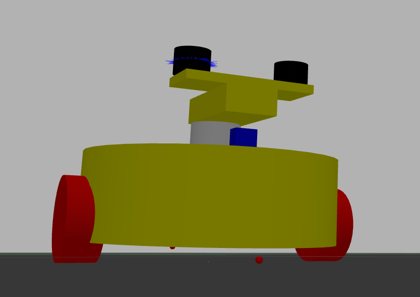

### 项目概述
本项目 `SLAM-2023` 是一个基于ROS（Robot Operating System）的项目，项目包含多个ROS包，每个包都有其特定的功能，如机器人描述、激光雷达驱动、导航算法等。
### 项目概述
本项目 `SLAM-2023` 是一个基于ROS（Robot Operating System）的项目，利用amcl感知+gmapping建图+move_base路径规划，涉及机器人的建图、导航等功能。项目采用创新的双雷达方案，有效避免了机器人云台对雷达的遮挡问题，显著提升了定位精度和环境感知能力。项目包含多个ROS包，每个包都有其特定的功能，如机器人描述、激光雷达驱动、导航算法等。

### 项目结构
项目包含以下主要的ROS包：
1. **rmus_map_2**：包含机器人的URDF描述、配置数据、3D模型和启动文件。
2. **rmus_map_gazebo**：与Gazebo仿真环境相关的配置和代码。
3. **mycar**：包含机器人的控制、导航和传感器处理等功能。
4. **car_description**：机器人的描述文件，用于在ROS中定义机器人的结构和属性。
5. **wr_fslidar**：激光雷达的驱动程序，用于获取激光雷达数据。

### 双雷达方案技术说明
为解决机器人云台对雷达的遮挡问题，本项目采用了以下技术方案：
1. **硬件部署**：在机器人的左右两侧各安装一个激光雷达，通过URDF文件精确设置雷达的位置和朝向，确保覆盖范围最大化。
2. **数据处理**：每个雷达在源文件中仅保留180度有效数据，避免无效数据干扰。
3. **数据融合**：开发了专用算法将两个雷达的180度数据进行拼接融合，形成完整的360度环境感知。
4. **定位优化**：融合后的雷达数据输入到AMCL（Adaptive Monte Carlo Localization）算法中，实现高精度定位。

### 编译项目
在项目根目录下，使用以下命令编译项目：
```bash
cd SLAM-2023/src
catkin_make
```

### 运行项目
编译成功后，你可以使用以下命令启动不同的功能：
#### 启动Gazebo仿真环境
```bash
roslaunch rmus_map_gazebo <launch-file-name>.launch
```

#### 启动机器人控制和导航
```bash
roslaunch mycar nav.launch
```

### 代码说明
#### rmus_map_2
该功能包是机器人模型及相关配置的核心存储地。
- `package.xml`：定义了包的元信息，包括包名、版本、描述、依赖等，清晰标注了此包运行所依赖的其他ROS包，确保运行环境准确无误。
- `CMakeLists.txt`：作为CMake配置文件，用于编译和安装包，规定了代码的编译规则和安装路径。
- **URDF文件**：通过URDF（Unified Robot Description Format）语言定义机器人的三维结构，包括机器人主体、双雷达等组件的几何形状、尺寸、质量等物理属性，同时精确设置两个雷达分别位于机器人两侧的位置和朝向，确保雷达扫描不受云台遮挡 ，为机器人在ROS系统中的可视化和运动学计算提供基础。
- **配置数据**：存储机器人运行过程中的各类参数配置，如关节运动范围、传感器数据采集频率等，方便根据实际需求灵活调整机器人的行为表现。
- **3D模型**：包含机器人及其组件的可视化模型文件，在RViz、Gazebo等可视化工具中展示机器人外观，帮助开发者直观了解机器人结构。
- **启动文件**：包含启动机器人相关功能的`.launch`文件，可一键启动机器人模型在RViz中的显示、关节状态发布等多个节点，简化开发调试流程。

#### rmus_map_gazebo
此功能包专注于Gazebo仿真环境相关配置与代码。
- `package.xml`：定义包的元信息，明确其在ROS生态中的身份标识及依赖关系。
- `CMakeLists.txt`：包含编译和安装包的相关配置，确保包内代码能够正确编译，生成可在Gazebo中运行的插件或节点。
- **Gazebo世界配置文件**：定义机器人运行的虚拟环境，如地形地貌、障碍物布局、光照条件等，开发者可根据需求创建不同场景，模拟机器人在复杂环境下的运行情况。
- **Gazebo插件代码**：编写用于控制机器人在Gazebo中行为的插件，例如为机器人添加物理约束、设置传感器在仿真环境中的数据生成规则，实现机器人与虚拟环境的交互，使仿真更加贴近真实情况。
- **仿真启动文件**：通过`.launch`文件整合Gazebo环境启动、机器人模型加载、传感器数据发布等多个环节，方便快速启动仿真，开展算法测试与验证工作。

#### mycar
该功能包是机器人控制、导航与传感器数据处理的核心中枢。
- `package.xml`：定义包的元信息和依赖，确保包内功能运行所需的外部支持准确导入。
- `CMakeLists.txt`：包含编译和安装包的相关配置，定义多个C++可执行文件，明确代码编译后的可执行程序生成规则。
- **机器人控制节点**：接收外部控制指令（如键盘控制、路径规划指令），通过计算将指令转化为机器人各关节或驱动轮的运动控制信号，实现机器人的移动、转向等动作。
- **导航算法实现**：集成路径规划、避障等导航算法，根据激光雷达等传感器采集的环境数据，结合预先构建的地图，为机器人规划安全、高效的行驶路径，并在遇到障碍物时实时调整路径。
- **雷达数据融合节点**：专门实现两个雷达180度数据的拼接和融合，通过特定算法将左右雷达数据整合，生成完整的360度环境点云数据，并发布到ROS话题中，为后续定位、建图等功能提供全面的环境感知信息。
- **AMCL配置文件**：针对双雷达数据特性，对AMCL算法的参数进行优化设置，如粒子数量、传感器模型等，提升机器人在融合数据下的定位精度，确保机器人能够准确确定自身在地图中的位置。

#### car_description
此功能包主要负责机器人描述相关工作。
- `package.xml`：定义包的元信息和依赖，保证与其他功能包的兼容性。
- `CMakeLists.txt`：作为编译和安装包的配置文件，规范代码编译过程。
- **机器人URDF/XACRO文件**：以URDF或更简洁的XACRO格式详细描述机器人的结构和属性，包括连杆（Link）和关节（Joint）的定义。连杆描述机器人各部件的几何和物理特性，关节则定义部件之间的连接方式和运动类型，为机器人运动学和动力学分析提供基础数据。

#### wr_fslidar
该功能包是激光雷达驱动的关键部分。
- `package.xml`：定义包的元信息和依赖，明确与其他功能包的数据交互需求。
- `CMakeLists.txt`：包含编译和安装包的相关配置，定义两个C++可执行文件，用于编译激光雷达驱动的核心代码。
- **雷达驱动代码**：实现与激光雷达硬件的通信，接收雷达原始数据，并对数据进行解析处理。支持数据裁切功能，可通过配置参数使雷达只发布180度有效数据，减少无效数据传输与处理，提高数据处理效率。同时，将处理后的数据以ROS话题形式发布，供其他功能包订阅使用 。

### 注意事项
- 请确保你已经正确安装了ROS和相关的依赖。
- 在编译和运行项目之前，请确保你的ROS环境已经正确配置。
- 如果你在编译或运行过程中遇到问题，请检查依赖是否安装正确，并查看终端输出的错误信息。
